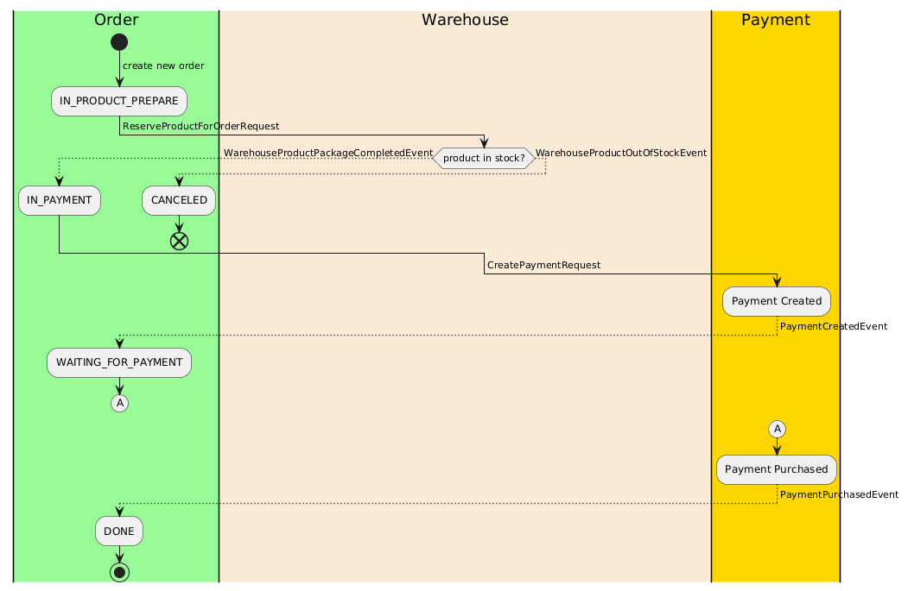

# Modulith project using Spring Native and Spring Modulith

## Commands
``` shell 
docker build . --tag spring-modulith-kotlin:latest --platform=linux/amd64
docker run --rm -p 8080:8080 spring-modulith-kotlin:latest
docker run --rm -p 8080:8080 -e APP_METHOD_API_TOKEN='' -e APP_H2_PASS='' -e CLIENT_ID='' -e CLIENT_SECRET='' -e DOMAIN='' spring-modulith-kotlin:latest
```

```shell
docker tag spring-modulith-kotlin:latest codehunter6323/spring-modulith-kotlin:latest
docker push codehunter6323/spring-modulith-kotlin:latest
```
```shell
# show docker account list
less ~/.docker/config.json
# run docker image test
docker run -it --rm --entrypoint /bin/bash ghcr.io/graalvm/native-image-community:21
 
docker run -it --rm --entrypoint /bin/bash ghcr.io/graalvm/graalvm-community:21
docker run -it --rm --entrypoint /bin/bash ghcr.io/graalvm/native-image-community:21-muslib
docker run -it --rm --entrypoint /bin/bash ghcr.io/graalvm/jdk-community:21
```

```shell
# run local zipkin
docker run -d -p 9411:9411 openzipkin/zipkin  
```

https://hilla.dev/blog/ai-chatbot-in-java/deploying-a-spring-boot-app-as-a-graalvm-native-image-with-docker/

[GraalVM gu remove](https://github.com/oracle/graal/issues/6855)


## Food Ordering flow

